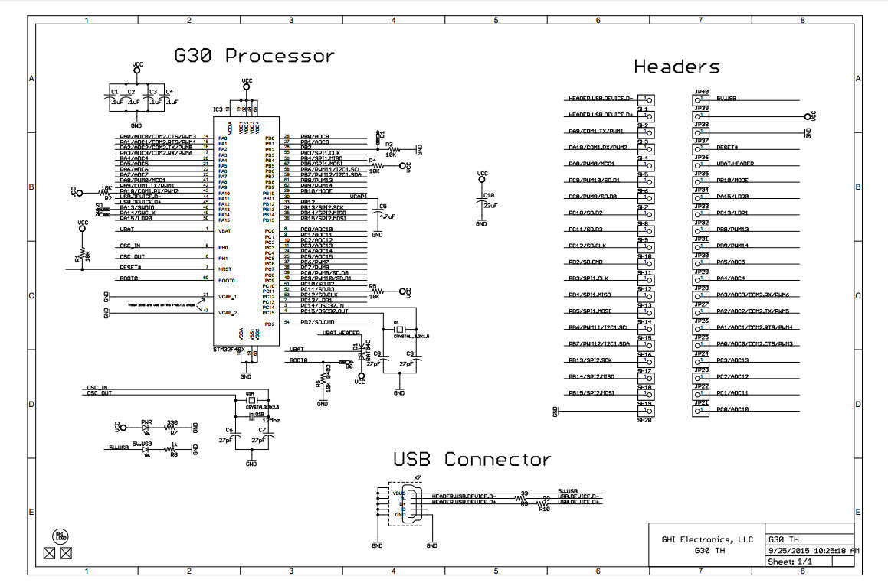
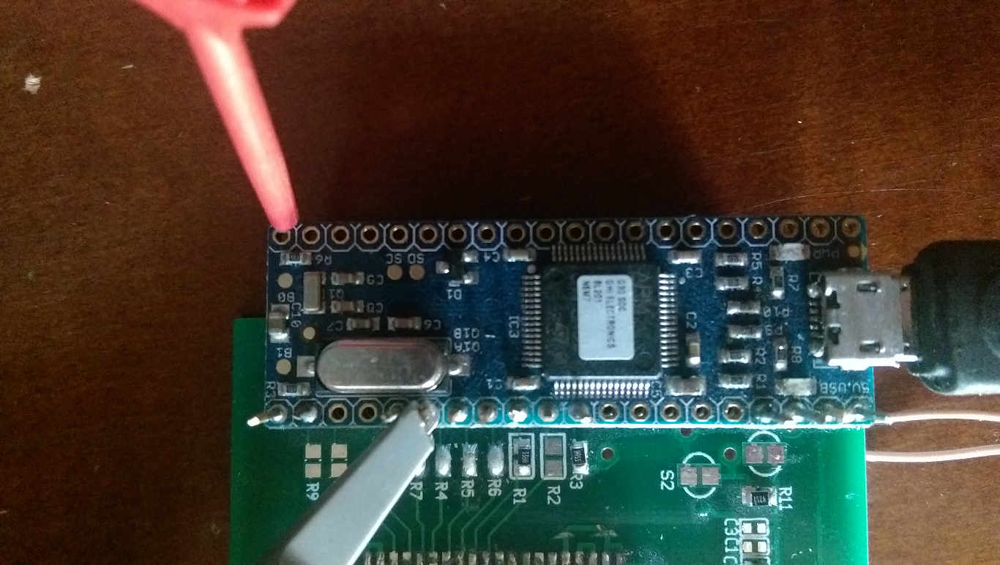
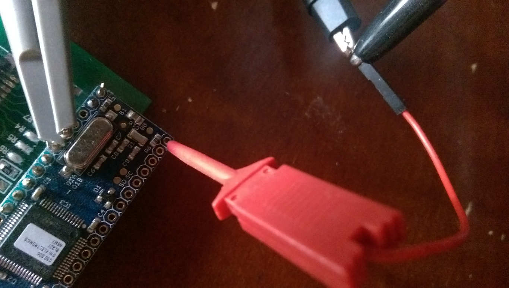
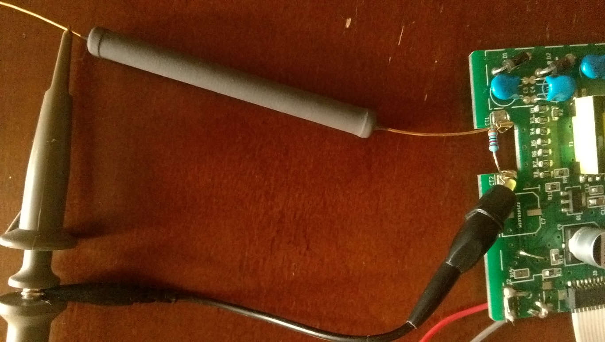
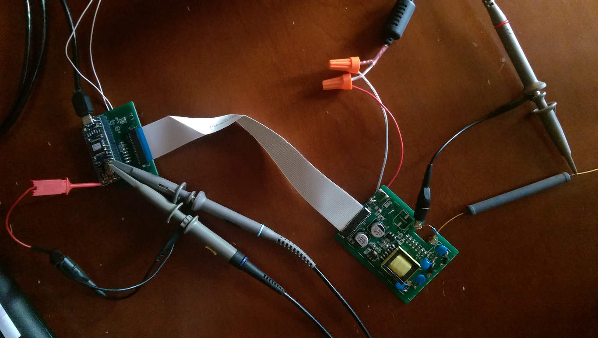

Table of Contents
=================

   * [GIT workflow methods](#git-workflow-methods)
      * [Setting up your GIT clone with collaborators:](#setting-up-your-git-clone-with-collaborators)
      * [reset a collaborator's master to kanzure's master](#reset-a-collaborators-master-to-kanzures-master)
      * [Merging branches (will usually leave a "merge commit" which rebasing can avoid)](#merging-branches-will-usually-leave-a-merge-commit-which-rebasing-can-avoid)
      * [Rebasing branches](#rebasing-branches)
         * [Squashing commits with rebase](#squashing-commits-with-rebase)
      * [Setup better git difftool/mergetool](#setup-better-git-difftoolmergetool)
   * [Creating table-of-contents for MarkDown (.md) files](#creating-table-of-contents-for-markdown-md-files)
   * [Preview MarkDown files locally before commit/push to GitHub](#preview-markdown-files-locally-before-commitpush-to-github)
   * [Self-Test Idea](#self-test-idea)
      * [Debug setup](#debug-setup)
      * [ADC pulse viewer GUI](#adc-pulse-viewer-gui)
   * [MicroPython C Modules](#micropython-c-modules)


# GIT workflow methods
## Setting up your GIT clone with collaborators:
* Adding a collaborator's github URL
  * ```bash
    git remote add collaborator https://github.com/<collaborator_username>/culture_shock.git
    git fetch collaborator
    ```


## reset a collaborator's master to kanzure's master
based on this StackOverflow (https://stackoverflow.com/a/39628366/253127)

* add the original (kanzure's) repo:
  * `git remote add original https://github.com/kanzure/culture_shock.git`
* Fetch the latest changes from the collaborator
  * `git fetch original`
* Checkout your __local__ master branch
  * `git checkout master`
* reset master to original's version, so your files match theirs exactly
  * `git reset --hard original/master`


## Merging branches (will usually leave a "merge commit" which rebasing can avoid)
* Fetch the latest changes from the collaborator
  * `git fetch collaborator`
* Merge the collaborator's changes (from master branch)
  * `git merge collaborator/master`


## Rebasing branches 
* Fetch the latest changes from the collaborator
  * `git fetch collaborator`
* Checkout the collaborator's changes (from master branch)
  * `git checkout collaborator/master`
* Depending on if merge conflicts are expected
  * If not, then use __non-interactive__ rebasing
    * `git rebase master`
  * If yes (or you want to squash/edit their commits/commit-messages), then use __interactive__ rebasing
    * `git rebase -i master`
* If there are merge conflicts
  * show the files in question
    * `git status`
  * use git's mergetool to see the your changes and their changes side-by-side
    * single file
      * `git mergetool path/to/file_of_interest`
    * all files in question
      * `git mergetool`
* Create a temporary branch for safety
  * `git checkout -b mergeme`
* Go back to __your__ last version of __master__ branch
  * `git checkout master`
* Merge your rebased changes into master
  * `git merge mergeme`

### Squashing commits with rebase
* I am currently using this method during debugging of the MarkDown syntax used for this note
  * ```
    git add DEVELOPER_NOTE.md
    git commit -m "sqsh"
    git rebase -i HEAD~2
    ```
* the last command allows you to modify whether the last (2) commits are applied, how they are applied, in what order
* I see the following output
  * ```
    pick 12e8eee added notes for syncing with other github 'forks' (collaborators)
    pick 7f7aedb sqsh
    
    # Rebase aebf933..7f7aedb onto aebf933 (2 command(s))
    #
    # Commands:
    # p, pick = use commit
    # r, reword = use commit, but edit the commit message
    # e, edit = use commit, but stop for amending
    # s, squash = use commit, but meld into previous commit
    # f, fixup = like "squash", but discard this commit's log message
    # x, exec = run command (the rest of the line) using shell
    # d, drop = remove commit
    #
    # These lines can be re-ordered; they are executed from top to bottom.
    #
    # If you remove a line here THAT COMMIT WILL BE LOST.
    #
    # However, if you remove everything, the rebase will be aborted.
    #
    # Note that empty commits are commented out
    ```
* I would then edit the second line to read
  * `s 7f7aedb sqsh`
  * This squashes the commit into the previous (commit above it)
    * the goal is to merge the commit-contents into the previous commit, but hide the fact that the contents actually came from more than one commit (squashing all changes into a single commit)
* save the text file
* now rebase will open the commit-message, showing all the combined messages
  * ```
    # This is a combination of 2 commits.
    # The first commit's message is:
    
    added notes for syncing with other github 'forks' (collaborators)
    
    # This is the 2nd commit message:
    
    sqsh
    
    # Please enter the commit message for your changes. Lines starting
    # with '#' will be ignored, and an empty message aborts the commit.
    # interactive rebase in progress; onto 7120033
    # Last commands done (2 commands done):
    #    pick 3a59de4 added notes for syncing with other github 'forks' (collaborators)
    #    s 63cf084 sqsh
    # No commands remaining.
    # You are currently rebasing branch 'master' on '7120033'.
    #
    # Changes to be committed:
    #       modified:   DEVELOPER_NOTE.md
    ```
  * remove the line starting with
    * `sqsh`
* save and exit the commit-message
* Done!
  * continue working, push, etc
    * during this debug cycle, because I continually edit the MarkDown, then squash, to test the web-browser rendering I then have to run a `git push -f` to force-push and overwrite the previous commit I made, because it was already made public


## Setup better git difftool/mergetool
* What look to be pretty good notes here:
  * https://gist.github.com/karenyyng/f19ff75c60f18b4b8149#file-git_mergetool_tutorial-md
* Setting a specific mergetool/difftool which is already supported by git
  * from: https://stackoverflow.com/a/6412645/253127
  * example of open-source tools supported
    * kdiff3, kompare, tkdiff, meld, xxdiff, emerge, vimdiff, gvimdiff, ecmerge, diffuse, opendiff, p4merge and araxis
  * add the following lines to your `~/.gitconfig`
    * ```
      [diff]
          tool = meld
      ```
* Setting up mergetool/difftool that isn't supported
  * the stackoverflow linked from the prev also works, but looks to be a less-concise copy of this
    * see "Git 1.7.x and older" section
      * https://www.scootersoftware.com/support.php?zz=kb_vcs#gitlinux


# Creating table-of-contents for MarkDown (.md) files
* get this handy TOC generator
  * `git clone https://github.com/ekalinin/github-markdown-toc`
* cd to the __culture_shock__ repo, then run the TOC generator on the .md file of interest
  * `cd culture_shock`
  * `../github-markdown-toc/gh-md-toc DEVELOPER_NOTE.md`
* paste the output into the .md file
* commit and push


# Preview MarkDown files locally before commit/push to GitHub
* Download `grip` with `pip`
  * `pip install grip`
    * source https://github.com/joeyespo/grip
* `cd` to __culture_shock__ repo
* run `grip`
  * copy the web URL printed on the terminal
    * navigate to it using your web-browser


# Self-Test Idea
* Setup 10 pulses with shortest possible pulse-width
  * setup list `adc_vals`
* Setup ADC timer with same freq as pulses, but out of phase 180°
* setup IRQ function callback on ADC timer, the function will:
  * read the ADC, append to `adc_vals`
* at end of pulse-train, send `adc_vals` out the serial port for printing on the user-terminal


## Debug setup
* PA0 and PA1, as seen here, are responsible for pulsing
")
* Connect your oscilloscope to these pins to watch the pulse widths and periods of each digital operation from the microcontroller
  * These are useful to trigger on
    * you can then watch the analog/choppier high-voltage develop on another oscilloscope input
* With Culture_Shock v0.1, the G30TH module was used for the STM microcontroller it was built with
  * The pinout of the G30TH module is shown here on the right-side

* Connecting the first oscilloscope probe to PA1 and GND (red minigrabber)
  
* Connecting the second oscilloscope probe to PA0
  
* Connecting the third oscilloscope probe and 1GOhm resistor to the high-voltage (HV) output
  * 33 kOhm dummy load is used between the HV terminals
  
* Overall setup
  

## ADC pulse viewer GUI
* requires pexpect `pip install pexpect` and tk (comes with Python out-of-box in most cases)
  * pexpect is a terminal interaction library
    * you can send lines to a terminal
    * you setup what you expect the terminal to reply with
      * these act like triggers to tell your program your output was seen
* I used `picocom` for test and development
  * thus what I programmed the <b>expect</b>ations to be might need adjusted for other terminal programs
* the terminal interaction is logged to the command-line where you start the GUI
  * use this to debug why your <b>expect</b>ations aren't being met
* every time the __pulse__ button is clicked, the __a()__ function is called using the 3 input boxes for args
  * reduce the __Num Pulse Pairs__ for a first-try adjustment
    * you should see the waveform get shorter in length
* __NOTE__: this __is__ still __work-in-progress__, dependent on the ADC working, which is still WIP
  * has not been rigourously debugged, understood, or tested with conditions other than the default (starting) conditions for period, width, num-pulses


# MicroPython C Modules
In case we really need to customize or reduce overhead
* http://micropython-dev-docs.readthedocs.io/en/latest/adding-module.html