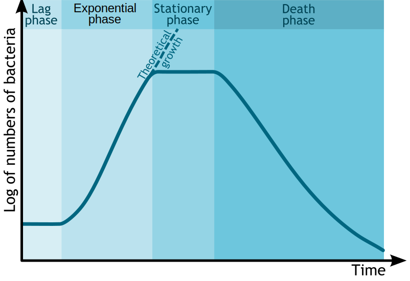

Culture_Shock Lab Manual - Table of Contents
=================

   * [Growth media preparation](#growth-media-preparation)
      * [Background](#background)
      * [Sources](#sources)
         * [LB broth](#lb-broth)
         * [LB agar](#lb-agar)
      * [Protocols](#protocols)
         * [LB Broth](#lb-broth-1)
         * [LB Agar Plates](#lb-agar-plates)
         * [Weighing powder step-by-step](#weighing-powder-step-by-step)
         * [Sterilization of culture media](#sterilization-of-culture-media)
            * [Wet Sterilization](#wet-sterilization)
               * [Step-by-step](#step-by-step)
         * [Dry Sterilization](#dry-sterilization)
         * [Adding antibiotics or other heat-sensitive chemicals to agar or broth media](#adding-antibiotics-or-other-heat-sensitive-chemicals-to-agar-or-broth-media)
   * [Cell Subculture basics](#cell-subculture-basics)
   * [Subculture with broth](#subculture-with-broth)
   * [Subculture with agar](#subculture-with-agar)
      * [if original bacterial culture is from a solid/firm culture source](#if-original-bacterial-culture-is-from-a-solidfirm-culture-source)
      * [if original bacterial culture is from a liquid culture source](#if-original-bacterial-culture-is-from-a-liquid-culture-source)
   * [Transformation](#transformation)
      * [Chemical Transformation (CaCl2)](#chemical-transformation-cacl2)
      * [Electroporation (culture_shock method!)](#electroporation-culture_shock-method)
   * [Overall steps (E.coli subculture, plasmid extraction, plasmid electroporation)](#overall-steps-ecoli-subculture-plasmid-extraction-plasmid-electroporation)
      * [Day 1](#day-1)
      * [Day 2](#day-2)
      * [Day 3](#day-3)
      * [Day 3.5](#day-35)
      * [Day 4](#day-4)

# Growth media preparation
## Background
Sterilization of nutrients and energy sources, and to prevent competition with any organisms we wish to grow, we aim to kill off all other organisms.

It has been found that E.Coli prefers a salty broth with protein and nutrients, usually made from:
* tryptone
  * casein protein from milk that has been partially digested into shorter fragments using the protease enzyme Trypsin, which in found for instance in the Human intestine
* NaCl
  * sodium chloride, for osmotic balance
* yeast extract
  * vitamins; minerals; trace elements like N, S, and Mg; a plethora of other organic compounds helpful for bacterial growth

This broth may be stabilized into a gel using agar, a polysaccharide extracted from algae which is indigestible for many microbes. Gelatin is not preferred as it is made of protein, which is quick to be digested by growing organisms, turning soupy. 

## Sources
### LB broth
* [from The-ODIN](https://www.the-odin.com/lb-powdered-media/)
  * Lennox recipe, which has 5g/L NaCl salt:
    * 10g/L Tryptone
    * 5 g/L Yeast Extract
    * 5 g/L NaCl

### LB agar
* [from The-ODIN](https://www.the-odin.com/lb-agar/)
  * Miller recipe, which has 10g/L NaCl salt:
    * 5 g/L Tryptone
    * 5 g/L Yeast Extract
    * 10g/L NaCl
    * 15g/L Agar

## Protocols

### LB Broth
* mix 20 g __LB broth powder mix__ with 1 Liter of distilled water

### LB Agar Plates
* mix 40 g __LB agar powder mix__ with 1 Liter of distilled water, then autoclave. 1 Liter makes ~35-40 Plates.
  * read The-ODIN's instructions [here](https://docs.google.com/document/d/1UcbshGXeTEyNg-4ZxiJDeOM8r6mN5CZDreM5c7n6bzE/edit)

### Weighing powder step-by-step
* obtain glass container which is heat safe (canning jar, erlenmeyer flask)
* put on a pair of nitrile gloves
* place weigh boat on scale
* turn on scale, wait for it to read __0.0__
* hold powder bottle in one hand
* to open, unscrew the lid with your other hand
  * I don't recommend putting the lid down, I would continue to hold it
* tap the bottle to slowly shake out the powder into the weigh boat
* tilt the bottle less and less, as you approach 20.0 grams on the scale display
* close the bottle
* dump the contents of the weigh boat into a glass container (canning jar, erlenmeyer flask)
* add distilled water 
  * tap water will likely suffice, but may be more variable from day-to-day than bottled distilled water
* finish with "Wet Sterilization" instructions

### Sterilization of culture media
Industrial, commercial, academic, and medical professions use a device called an autoclave to sterilize growth media and other things like empty containers, cloths, and metal tools. Autoclaves are basically automated pressure-cookers.

#### Wet Sterilization
* heat is transferred via exposure to steam
* requires 121 °C (250 °F) for 15 to 30 minutes, depending on liquid volume and container geometry.
  * pressure cookers working at 15 PSI (at sea level) will produce 121 °C

##### Step-by-step
* obtain container with agar or broth mixture in it
* cover the container opening with a square piece of aluminum foil
* swirl gently to mix, don't worry if it doesn't all dissolve, the heat during sterilzation will take care of that

__NOTE__: do not fill any container more than 50% full, it risks overflowing during sterilization due to bubbles and/or froth
* add water to 

### Dry Sterilization
* uses an oven and heats through convection and radiation
* requires 160 °C (320 °F) for 2 hours or 170 °C (340 °F) for 1 hour.
  * use an oven bag, like those sold by the Reynolds company for baking turkeys inside of (remember the product "Shake 'n Bake"?)
* Instruments should be dry before sterilization since water will interfere with the process.

### Adding antibiotics or other heat-sensitive chemicals to agar or broth media
Some chemicals are very heat-sensitive and need to be added after sterilization, when the media container has cooled to the (per-chemical) specified temperature.

# Cell Subculture basics
* Once you have broth media, you can add bacteria to it with a sterile stick or metal/plastic innoculation loop.
* Sometimes you don't trust the source of the bacteria, and want to make sure there isn't contamination from other species.
* For these situations you will use a planar growth media, otherwise known as agar gel media (petri dishes, or 'plates').
* By reducing the available growth surface to essentially a solid 2D plane, you may see segregated and distinct growth patterns when multiple species are growing at once.
* This also enables you to remove a portion of these 'colonies' which are pure-appearing, and repeat this subculture growth process on a fresh agar plate, to purify mixed cultures over multiple selection steps.

# Subculture with broth
* if original bacterial culture is from a solid/firm culture source
  * Using a sterile stick/toothpick/innoculation-loop, retrieve a sample from a single colony (or more if desired)
* if original bacterial culture is from a liquid culture source
  * Using a pipette, aspirate (suck) 0.1 to 1.0 mL (usually, depends on the specific experiment)
* Open the media jar in a clean-air (HEPA filtered) or still-air
* place the stick/toothpick/innoculation-loop into the broth, flick/swish/rotate
  * __be careful not to touch the container insides__ with your glove
* close the jar
* label the jar with a sharpie marker (you may use a piece of masking tape to write on)
* place in incubator

# Subculture with agar
## if original bacterial culture is from a solid/firm culture source
* Using a sterile stick or toothpick, retrieve a sample from a single colony (or more if desired)
* Open the petri dish
* place the stick onto the surface of the agar
* gently drag the stick across the surface, from one side to the other
* continue in a zig-zag fashion down the remaining surface
  * if your drag lines do not cross, this will effectively dilute the number of bacteria (colony formation units, CFUs) along the entire streak, with the most bacteria being concentrated at the beginning and least at the end.
* label the petri dish with a sharpie marker (you may use a piece of masking tape to write on)
* place in incubator

## if original bacterial culture is from a liquid culture source
* Using a pipette, aspirate (suck) 0.1 mL (usually, maybe less if this is determined to be too wet)
* dispense liquid culture on the surface of the agar
* if you have a cell spreader (L shaped piece of metal or glass)
  * gently drag and push the spreader back and forth across the surface of the agar
  * rotate the petri dish with your other hand, as you continue to push and pull the cell spreader
  * continue until you have made several complete rotations of the petri dish while spreading
* if you have sterile glass beads
  * place the beads into the petri dish, cover the dish
  * roll the beads around to attempt to evenly distribute the liquid across the agar surface
  * open the dish, pour out the beads into a container
* label the petri dish with a sharpie marker (you may use a piece of masking tape to write on)
* place the petri dish in incubator

# Transformation
## Chemical Transformation (CaCl2)
Read The-ODIN's protocol for transforming a plasmid into E.Coli [here](https://docs.google.com/document/d/1fGiyux6qxCHHIzhYNCZx23z8v785IhyUg_CP57odpv4/edit)
* requires extra chemicals (CaCl2)
* requires 30 minute cool-down
* requires 30 second heat-shock

## Electroporation (culture_shock method!)
* obtain 1mL of log-phase E.Coli broth culture (log-phase occurs after about 4-6-hours in 37° shaker incubator)

 from M.Komorniczak at wikimedia

* determine how many RPMs you need to centrifuge your cells at, based on the radius of your centrifuge rotor
  * We are going 'softer' than the common rule of thumb: __aiming to achieve 2000 [RCF](https://en.wikipedia.org/wiki/Centrifuge#Mathematical_description) ("g"s)__
    * rule of thumb: 180-250 rcf, 5 mins for mammalian cells; 4000-6000 rcf, 5-10 mins for bacteria
    * [Use this handy RCF (g-forces) to RPM calculator](http://insilico.ehu.es/mini_tools/rcf_rpm.php), you just need to measure your rotor in __mm__
* repeat the following (3) times
  * centrifuge the cell solution at the calculated RPM for 3 minutes
  * discard the liquid, allowing the "cell pellet" to remain
  * add 1 mL distilled H2O
  * resuspend by pulsing with vortexer
* resuspend once more in H2O, either 75 µL or 200µL
  * for 2 mm gap electroporation cuvette, pipette 200 µl (completely full)
  * for 1 mm gap VWR electroporation cuvette, pipette 75 µl  (completely full)

* Transfer 1 pg–100 ng of plasmid DNA (1–5 µl) to cells and mix without vortexing.
  
Electroporation at low temperature (0-4 °C) seems to work best according to evidence, and efficiencies may drop ~100-fold at room temperature
* for best results, pre-chill the cuvette and cell suspension on ice for 1 to 2 minutes

* transfer cell solution to electroporation cuvette
  * for 2 mm gap electroporation cuvette, maximum volume during pulse is 400 µl
  * for 1 mm gap VWR electroporation cuvette,  preferred volume during pulse is 75 µl tolerance 10% over, zero under.

## [pulse with E.coli settings  ](https://github.com/kanzure/culture_shock/USING_CULTURE_SHOCK.md "Using culture shock")
* immediately add 1mL LB broth (or SOC broth for better efficiency)
* incubate for 30 to 60 mins
  * if ampicillin resistance gene was transformed 30 mins
  * if kanamycin, 60 mins
* transfer to agar plates, using [cell-spreader technique](#if-original-bacterial-culture-is-from-a-liquid-culture-source)

# Overall steps (E.coli subculture, plasmid extraction, plasmid electroporation)
## Day 1
* Prepare agar, agar+antibiotics, broth media
  * sterilize, let cool to antibiotic-safe temperature
  * add antibiotic to one of the two agar containers
    * write label, noting it has antibiotics
  * add antibiotic to one of the two broth containers
    * write label, noting it has antibiotics
  * portion agar into petri dishes

* Subculture cells in agar to ensure purity
  * successive agar sub-culturing may be required if contamination is present
    * E.coli __with plasmid__ go on __antibiotic agar__
    * __'plain' E.coli__ go on __'plain' agar__

## Day 2
If agar cultures are OK, then continue...
* Subculture __with-plasmid__ cells in __antibiotic__ broth
  * incubate in shaker incubator (broth is shaking)

## Day 3
* perform plasmid extraction on 'with-plasmid' cell broth
  * label plasmid extract and place on ice
  * make agarose gel in microwave, pulsing 10 seconds at a time
  * prepare the gel tray by taping the open ends with masking tape
  * place gel comb in the tray at the side notches
  * cast the agarose into the gel tray
  * once cool, remove the masking tape and comb
  * place into the gel box
  * prepare gel electrophoresis buffer solution
  * pour buffer over the top of the gel, covering it by at least 5 millimeters
  * into a new tube, mix 2 μL loading dye per 10 μL of DNA sample.
  * Load 12 μL prepared ladder 
    * Typically load ladder in left-most lane and sometimes right-most lane as well depending on whether you have the space.
  * Load 2 samples left to right. 
    * Load 12 μL into each well
  * connect the gel box to the electrphoresis power supply
    * run at ~85 volts for 1 hr 20 mins
      * or 95 Volts for less than an hour
  * remove gel from gel box
  * stain gel with post-stain (GelGreen or GelRed equivalent) 
  * visualize with gel imager

__If plasmid-prep OK, then continue...__
* Subculture __'plain'__ cells in __'plain'__ broth
  * incubate in shaker incubator (broth is shaking)

## Day 3.5
* Concentrate the cells, chill, add DNA
* electroporate
* incubate during recovery
* plate recovered transformants on petri dishes __with antibiotic__ (use cell-spreader)
  * use 3 petri dishes, with 50 μL of cell suspension each
* plate recovered transformants on petri dish with __plain__ agar
  * this will be used to calculate transformation efficiency

## Day 4
* Check the petri dishes for colonies
* count the number of colonies on each of the (3) antibiotic plates, and the (1) 'plain' control plate
* the number of antibiotic cells divided by the number of plain-agar cells will tell us, of the cells which survived the shocking experience, what proportion took up the plasmid (possesing the antiobiotic resistance gene for selection)
